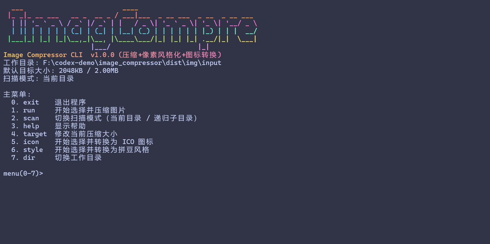

# Image Compressor 1.0.0

工具截图



一个面向本地批处理的图片工具，提供三类核心能力：

- JPEG 目标体积压缩（按 KB 目标自动质量/尺寸折中）
- 像素风格化（拼豆风格）转换
- Windows 图标转换（输出 `.ico`，支持多尺寸）

当前版本：`v1.0.0`（稳定首发版，功能聚焦“压缩 + 像素风格化 + 图标转换”）

## 功能概览

- `compress` 模式：将图片压缩到目标大小（KB）
- `perler` 模式：生成拼豆风格结果图（支持颜色数、网格、饱和度等参数）
- `icon` 模式：转换为 `.ico` 图标（默认尺寸 `16,32,48,64,128,256`）
- 目录批处理：支持递归处理子目录
- 交互模式：无参数启动菜单操作
- Windows 拖拽模式：将图片拖到 exe 上直接处理

## 目录结构

```text
.
├─ main.py
├─ compress.py                # 兼容入口，内部转发到 main
├─ core/                      # 核心算法与常量
├─ cli/                       # 命令行参数与执行分发
├─ ui/                        # 控制台展示与交互逻辑
├─ utils/                     # 路径与文件工具
├─ img/
│  ├─ input/                  # 输入图片目录（默认）
│  └─ output/                 # 输出图片目录（默认）
├─ build.ps1
├─ build.sh
├─ package.ps1
└─ RELEASE.md
```

## 快速开始

### 1) 安装依赖

```bash
python -m pip install -r requirements.txt
```

### 2) 查看版本

```bash
python main.py --version
python compress.py --version
```

### 3) 压缩单图

```bash
python main.py img/input/your.png -k 200
```

### 4) 像素风格化单图

```bash
python main.py img/input/your.png --mode perler --overwrite
```

### 5) 转换图标单图

```bash
python main.py img/input/your.png --mode icon --overwrite
```

## CLI 用法

```bash
python main.py <input> [options]
```

- `<input>`：图片文件或目录
- `--mode`：`compress` / `perler` / `icon`（默认 `compress`）
- `-k/--target-kb`：压缩目标大小（仅 `compress` 有效）
- `--icon-sizes`：图标尺寸列表（仅 `icon` 有效，逗号分隔，默认 `16,32,48,64,128,256`）
- `-o/--output`：输出文件（单图）或输出目录（目录模式）
- `--overwrite`：允许覆盖输出
- `-r/--recursive`：目录模式下递归处理
- `-v/--verbose`：输出每轮压缩细节

### `compress` 示例

```bash
python main.py img/input/your.png -k 200
python main.py img/input/your.jpg -k 300 -o img/output/out.jpg
python main.py img/input -k 300 --recursive
```

### `perler` 示例

```bash
python main.py img/input/your.png --mode perler
python main.py img/input/your.png --mode perler --perler-colors 32 --perler-grid 64
python main.py img/input --mode perler --recursive
```

### `icon` 示例

```bash
python main.py img/input/your.png --mode icon
python main.py img/input/your.png --mode icon --icon-sizes 32,64,128,256
python main.py img/input --mode icon --recursive
```

## 交互与拖拽

- 交互模式：

```bash
python main.py
```

- Windows 拖拽模式：将图片拖到 `image-compressor-*.exe` 上，程序会自动进入拖拽处理流程（支持 `compress` / `perler` / `icon` 三种处理方式）。

## 打包发布

### Windows（推荐）

```powershell
.\package.ps1
```

可选：

```powershell
.\package.ps1 -Version 1.0.0
.\build.ps1 -Version 1.0.0
```

### macOS / Linux

```bash
chmod +x build.sh
./build.sh main.py image-compressor 1.0.0
```

## 产物命名规则（1.0 起）

打包产物包含版本号，便于并存和回滚：
- Windows：`image-compressor-v1.0.0-windows-x64.exe`
- Windows 压缩包：`image-compressor-v1.0.0-windows-x64.zip`
- Unix 二进制：`image-compressor-v1.0.0-{platform}-{arch}`
- Unix 压缩包：`image-compressor-v1.0.0-{platform}-{arch}.tar.gz`

对应校验文件：`dist/SHA256SUMS.txt`

## 常见问题

- 输出文件已存在：加 `--overwrite` 或改 `-o`
- 路径有空格：请加引号
- macOS/Linux 无执行权限：`chmod +x <binary>`
- 打包失败：优先使用 `package.ps1`（会自动准备最小虚拟环境）

## 版本说明

- `v1.0.0`：重构后稳定首发版，聚焦压缩、像素风格化与图标转换。
- 后续发布细节请见 [RELEASE.md](./RELEASE.md)
